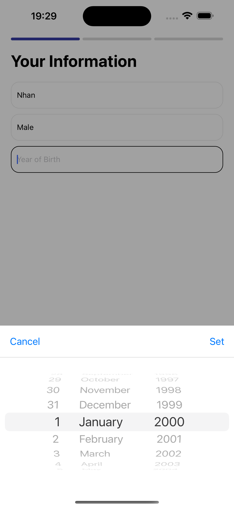
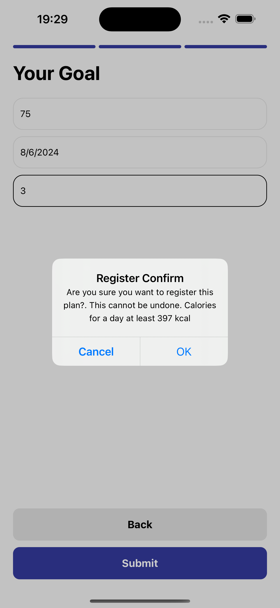
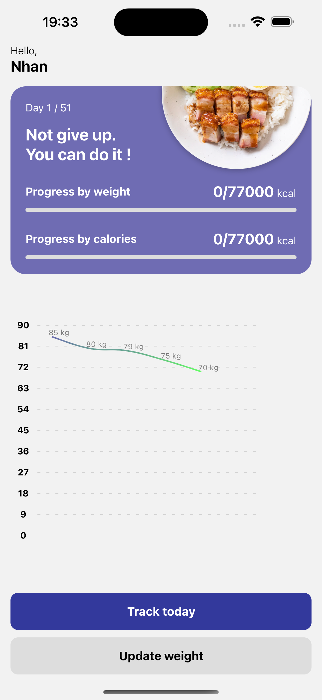

# Count clatories in everyday meals with Stepzen

This is a React Native Fitness Pal , using API edamam and Stepzen for backend graphql and database.

Additional features:

- [Expo Router](https://docs.expo.dev/routing/introduction/) file-based navigation and API Routes
- [Edaman](https://www.edamam.com/) api for food and calories 
- [Stepzen](https://stepzen.com/) build graphql server and database
- [Redux](https://redux.js.org/introduction/getting-started) for state management
- [Gifted Charts](https://gifted-charts.web.app) for charts

## Screenshots

## Demo

